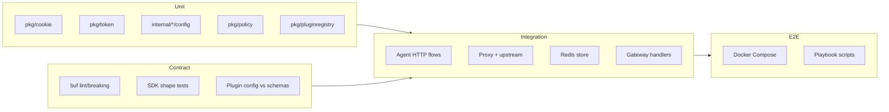

# Phase 9: Testing Strategy

## Current state

- **Unit**: [pkg/cookie/cookie_test.go](pkg/cookie/cookie_test.go) (EncodeValue/DecodeValue, Encrypt/Decrypt, SignedManager); [pkg/token/token_test.go](pkg/token/token_test.go) (NormalizeClaims, KeyFuncFromJWKS); [pkg/policy/policy_test.go](pkg/policy/policy_test.go) (Input, Decision, WASM fallback); [internal/agent/config/config_test.go](internal/agent/config/config_test.go) and [internal/proxy/config/config_test.go](internal/proxy/config/config_test.go) (Validate, LoadFromEnv via go-config). **Gaps**: no tests in [pkg/pluginregistry](pkg/pluginregistry); no file-based config validation tests reusing validateconfig flow; limited JWT issuer/audience/expiry tests; no Rego/WASM policy evaluation tests when engine is implemented.
- **Contract**: Proto enforced via `make proto-lint` and `make proto-breaking`. No explicit contract tests for SDK ↔ proto shape compatibility or plugin config ↔ schema.
- **Integration**: [internal/agent/httpserver/server_test.go](internal/agent/httpserver/server_test.go) and [internal/proxy/httpserver/server_test.go](internal/proxy/httpserver/server_test.go) only test server construction; [internal/store/redis/redis_test.go](internal/store/redis/redis_test.go) uses real Redis (skip if unavailable); [pkg/plugins/plugins_test.go](pkg/plugins/plugins_test.go) tests adapter construction and Handler presence. No full HTTP flows for agent (login/callback/refresh/logout) or proxy with mock upstream.
- **E2E**: [deployments/docker](deployments/docker) has compose and .env.example; no runnable E2E scenarios or playbooks.

---

## 1. Unit tests

| Area                              | Location                                                                                       | Scope                                                                                                                                                                                                                                                                                                         |
| --------------------------------- | ---------------------------------------------------------------------------------------------- | ------------------------------------------------------------------------------------------------------------------------------------------------------------------------------------------------------------------------------------------------------------------------------------------------------------- |
| **Cookie codecs**                 | [pkg/cookie](pkg/cookie)                                                                       | Extend [cookie_test.go](pkg/cookie/cookie_test.go): codec error paths (wrong key, tampered payload), chunking if used, optional same-site/secure/domain in manager tests.                                                                                                                                     |
| **JWT validation**                | [pkg/token](pkg/token)                                                                         | Add tests in [token_test.go](pkg/token/token_test.go): ValidateIDToken (or equivalent) with issuer/audience/expiry/nonce; invalid signature; missing kid; JWKS cache/key resolution edge cases.                                                                                                               |
| **Claims mapping**                | [pkg/token](pkg/token)                                                                         | Add cases in token tests: Principal from claims (sub, roles, groups, TenantContext); NormalizeClaims for groups and other standard paths.                                                                                                                                                                     |
| **Config validation (go-config)** | [internal/agent/config](internal/agent/config), [internal/proxy/config](internal/proxy/config) | Keep existing Validate + LoadFromEnv tests. Add test that runs same load path as [cmd/validateconfig](cmd/validateconfig) (file source + ApplyDefaults + Validate) for at least one example file from [configs/](configs/) (e.g. agent.example.json, proxy.example.yaml) so file-based validation is covered. |
| **Policy evaluation**             | [pkg/policy](pkg/policy)                                                                       | Keep Input/Decision/WASM fallback tests. When Rego or WASM bundle is implemented: add unit tests that load a minimal bundle and assert Evaluate returns expected Allow/StatusCode/Headers/Obligations for given Input.                                                                                        |
| **Plugin registry**               | [pkg/pluginregistry](pkg/pluginregistry)                                                       | Add **registry_test.go**: Register (success, duplicate ID → ErrAlreadyRegistered); Enable/Disable and ResolveByCapability (only enabled); ResolveAllByKind; BuildDependencyGraph (success, missing capability, cycle → ErrDependencyCycle); StartupOrder after BuildDependencyGraph; RegistrationFor.         |

---

## 2. Contract tests

| Area                     | Approach                                                                                                                                                                                                                                                                                                                                                                                                                                                                                                                                                                       |
| ------------------------ | ------------------------------------------------------------------------------------------------------------------------------------------------------------------------------------------------------------------------------------------------------------------------------------------------------------------------------------------------------------------------------------------------------------------------------------------------------------------------------------------------------------------------------------------------------------------------------ |
| **Proto compatibility**  | Rely on existing `make proto-lint` and `make proto-breaking`. Optionally add a small contract test (Go) that builds request/response types from generated proto and passes them to pkg/agent or pkg/proxy interfaces to ensure generated code stays usable.                                                                                                                                                                                                                                                                                                                    |
| **SDK expectations**     | **JS**: Extend [packages/sdk/js/core/src/index.test.ts](packages/sdk/js/core/src/index.test.ts) (or equivalent) to assert session/principal shapes match expectations (e.g. fields required by BFF/UI). **Go/Flutter**: Document or add tests that principal/session types used by SDKs align with proto/sdk/v1 (e.g. Principal.Subject, Session fields). No need to duplicate proto in tests if SDKs consume generated types.                                                                                                                                                 |
| **Plugin config schema** | Add test (e.g. in [pkg/pluginconfig](pkg/pluginconfig) or a small test in `cmd/validateconfig` / new `test/contract`) that: for each schema in [schemas/plugins](schemas/plugins) (integration/caddy, traefik, krakend; pipeline/ratelimit; provider/oidc), validates the corresponding example config from [configs/plugins](configs/plugins) using [pluginconfig.ValidateAgainstSchema](pkg/pluginconfig/pluginconfig.go) with a real JSON Schema validator (e.g. github.com/xeipuuv/gojsonschema or similar). Ensures example configs stay valid against published schemas. |

---

## 3. Integration tests

| Area                                     | Approach                                                                                                                                                                                                                                                                                                                                                                                                                                                                                                                                                                                                                                                                                                |
| ---------------------------------------- | ------------------------------------------------------------------------------------------------------------------------------------------------------------------------------------------------------------------------------------------------------------------------------------------------------------------------------------------------------------------------------------------------------------------------------------------------------------------------------------------------------------------------------------------------------------------------------------------------------------------------------------------------------------------------------------------------------- |
| **Agent: login/callback/refresh/logout** | Add integration tests (e.g. [internal/agent/integration_test.go](internal/agent/integration_test.go) or under `test/integration`) that start the agent HTTP server (using [internal/agent/httpserver](internal/agent/httpserver)) with a **mock IdP** (httptest server returning fixed auth URL, token response, JWKS). Exercise: GET /login → redirect to IdP; GET /callback?code=...&state=... → session cookie set and redirect; GET /session with cookie → 200 and session payload; GET /refresh with cookie → 200; GET /logout → cookie cleared and optional redirect. Use in-memory or test Redis (or skip if REDIS_URL not set, similar to [redis_test.go](internal/store/redis/redis_test.go)). |
| **Proxy with mock upstream**             | Add integration test: start proxy HTTP server with [internal/proxy/httpserver](internal/proxy/httpserver), [pkg/proxy.DefaultEngine](pkg/proxy/engine.go) with a test PrincipalResolver (e.g. fixed principal or session cookie resolved via agent client stub). Mock upstream as httptest server. Send request with cookie or header; assert 200 and upstream received expected headers (X-User-Id, etc.); send unauthenticated request with RequireAuth=true and assert 401.                                                                                                                                                                                                                          |
| **Redis session lifecycle**              | Keep [internal/store/redis/redis_test.go](internal/store/redis/redis_test.go) as integration tests (skip when Redis unavailable). Optionally add: session set/get/delete, PKCE set/get, refresh lock acquire/release. Document REDIS_URL for CI or use testcontainers for optional CI Redis.                                                                                                                                                                                                                                                                                                                                                                                                            |
| **Policy bundle enforcement**            | When policy bundle loading is implemented: integration test that loads a small bundle (Rego or WASM), runs proxy engine with that policy, and asserts one allow and one deny outcome for known inputs.                                                                                                                                                                                                                                                                                                                                                                                                                                                                                                  |
| **Gateway adapters**                     | Extend beyond [pkg/plugins/plugins_test.go](pkg/plugins/plugins_test.go): for Caddy/Traefik/KrakenD, add test that invokes the adapter’s Handler with httptest request/response, proxy engine that returns Allow with headers, and assert response status and headers (and for Traefik/Caddy that next is called or response is written as expected).                                                                                                                                                                                                                                                                                                                                                   |

---

## 4. E2E: Runnable scenarios

| Scenario                               | Goal                                                                                     | Implementation                                                                                                                                                                                                                                                                                                                                                                                                                                                                                                                                                               |
| -------------------------------------- | ---------------------------------------------------------------------------------------- | ---------------------------------------------------------------------------------------------------------------------------------------------------------------------------------------------------------------------------------------------------------------------------------------------------------------------------------------------------------------------------------------------------------------------------------------------------------------------------------------------------------------------------------------------------------------------------- |
| **Browser + agent + proxy + upstream** | One flow: browser (or curl) → login → callback → session → request via proxy → upstream. | Use [deployments/docker](deployments/docker): docker-compose that runs agent, proxy, mock upstream, and optional mock IdP (e.g. keycloak or minimal OIDC stub). Add a **Make target** (e.g. `make e2e-docker`) or script that starts compose, waits for health, runs a **playbook** (curl or small script): hit agent /login, follow redirect to IdP, simulate callback with code, then GET /session with cookie, then GET proxy path with cookie and assert upstream receives request. Document in [deployments/README.md](deployments/README.md) or new `docs/ops/e2e.md`. |
| **SPA + BFF**                          | Same stack; SPA uses SDK to get session and call BFF; BFF uses proxy.                    | Either extend the same compose + playbook to use a minimal SPA (or SDK-driven script) that calls agent for login/session and proxy for API, or document the scenario and leave automated E2E to the “browser + agent + proxy” flow plus manual SPA check.                                                                                                                                                                                                                                                                                                                    |
| **API-only**                           | No browser; client uses token (e.g. JWT) and proxy validates.                            | Same compose; playbook sends request to proxy with Authorization: Bearer ; proxy resolves principal from JWT and forwards to upstream. Assert 200 and upstream headers.                                                                                                                                                                                                                                                                                                                                                                                                      |
| **Caddy / Traefik / KrakenD**          | Each gateway in front of proxy; one successful auth request.                             | Add optional compose profiles or separate compose files that start Caddy, Traefik, or KrakenD using [configs/plugins](configs/plugins) examples, with agent + proxy + upstream. E2E script hits gateway URL with session cookie (obtained via agent in same run) and asserts 200 from upstream. Document in [docs/integration](docs/integration) (e.g. “E2E with Caddy”) and in deployments README.                                                                                                                                                                          |

---

## 5. Test layout and CI

- **Layout**: Keep unit tests next to code (`*_test.go`). Contract tests can live under `pkg/pluginconfig`, `test/contract`, or a single `test/` directory. Integration tests: `internal/agent`, `internal/proxy`, or `test/integration`. E2E: scripts and compose under `deployments/` and optionally `test/e2e` for playbooks.
- **Makefile**: Keep `test-go` as `go test ./...`. Integration tests that need Redis or optional services can use build tags (e.g. `integration`) or skip when env vars are unset. Add target `make e2e-docker` (or `make e2e`) that runs E2E playbook when docker-compose is available.
- **CI**: Run `make test` (and `make proto-lint`, `make proto-breaking`). Run integration tests that require Redis only when REDIS_URL is set (or use testcontainers). E2E can be a separate job or manual until stable.

---

## 6. Dependency overview

---

## 7. Implementation order

1. **Plugin registry unit tests** — pure logic, no new deps.
2. **Config validation unit test** — file-based load using existing validateconfig logic.
3. **Cookie/Token/Claims unit extensions** — error paths and JWT validation.
4. **Plugin config schema contract test** — wire a JSON Schema validator and validate configs/plugins examples.
5. **Agent integration tests** — mock IdP + agent server + Redis (skip if no Redis).
6. **Proxy integration tests** — proxy server + mock upstream + engine.
7. **Gateway adapter integration tests** — Handler with httptest.
8. **E2E** — docker-compose + playbook for browser + agent + proxy + upstream; then API-only; then optional Caddy/Traefik/KrakenD profiles.

Policy evaluation unit/integration tests depend on Rego/WASM bundle implementation; add them in the same phase as that work.