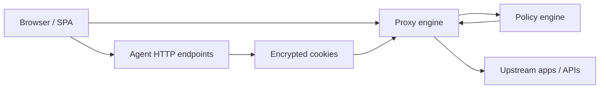

# Architecture overview

AuthSentinel consists of an OAuth Agent, an OAuth Proxy, an embedded policy engine, adapters/plugins, and SDKs.

High-level flow:

```mermaid
flowchart LR
  browser["Browser / SPA"]
  agent["Agent HTTP endpoints"]
  cookies["Encrypted cookies"]
  proxy["Proxy engine"]
  policyEngine["Policy engine"]
  upstream["Upstream apps / APIs"]

  browser --> agent
  agent --> cookies
  browser --> proxy
  cookies --> proxy
  proxy --> policyEngine
  policyEngine --> proxy
  proxy --> upstream
```

